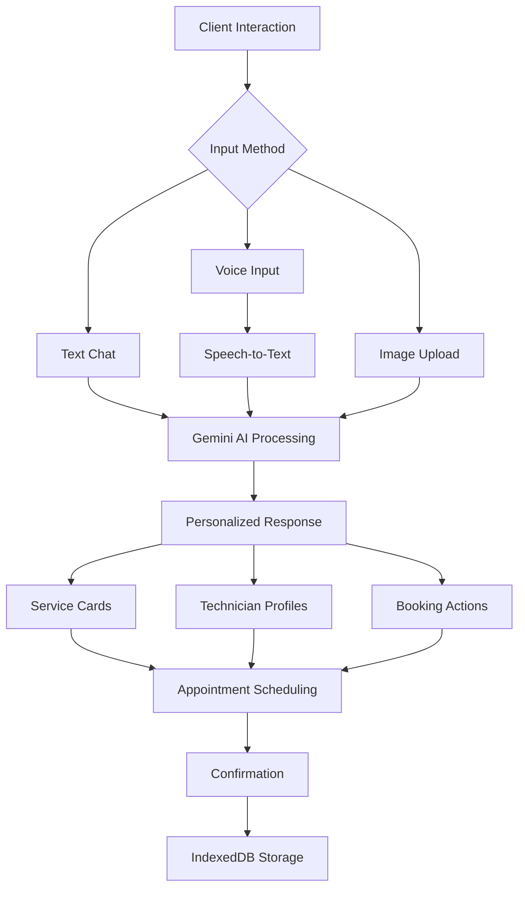
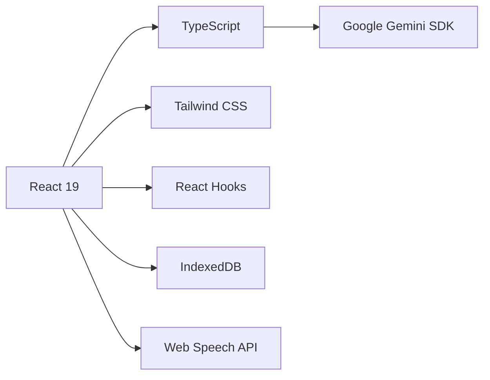
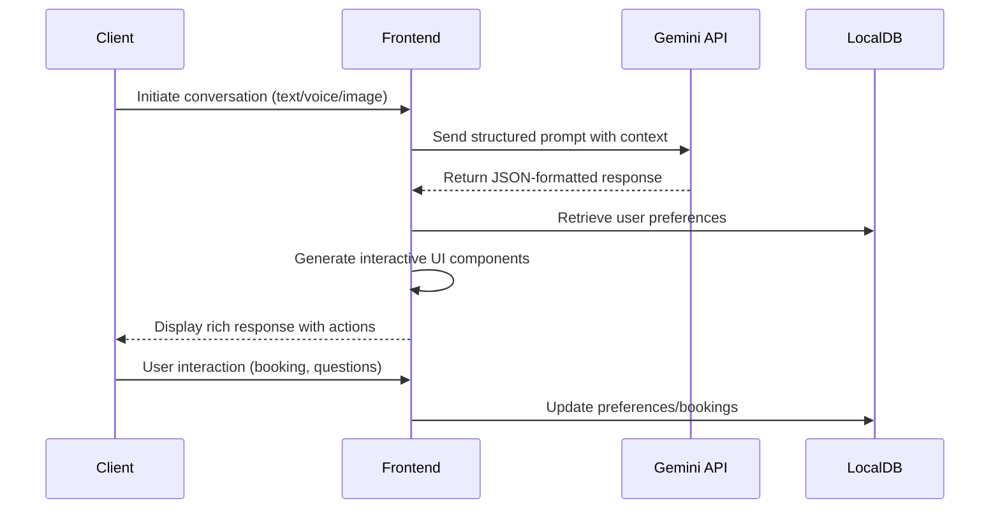

# 🌟 Serene AI Salon Assistant - Premium Client Experience Platform

  
*Interactive preview of Serene AI Salon Assistant (screenshot placeholder)*

[](https://react.dev)
[](https://www.typescriptlang.org/)
[](https://ai.google.dev)
[](https://tailwindcss.com)
[](https://opensource.org/licenses/MIT)

**Serene AI Salon Assistant** is an intelligent conversational platform transforming client experiences at premium salons and spas. Powered by Google's Gemini AI, it delivers a seamless booking journey with natural conversations, personalized recommendations, and rich interactive interfaces.



## ✨ Premium Features

### 💬 Natural Conversation Interface
- **Multi-modal Interactions**: Text, voice, and image inputs
- **Context-Aware Dialogues**: Maintains conversation context across sessions
- **Emotional Intelligence**: Detects client sentiment for personalized responses

### 🎨 Rich Interactive Elements
| Feature | Description | Benefit |
|---------|-------------|---------|
| **Service Cards** | Visual displays with images, pricing, duration | Quick comparison of options |
| **Technician Profiles** | Bios, specialties, availability, ratings | Informed technician selection |
| **Booking Widgets** | Calendar integration with real-time availability | One-click appointment scheduling |
| **Inspiration Gallery** | Save/style sharing with visual recommendations | Visualize desired outcomes |

### 🔒 Premium Client Experience
- **Personal Preference Profiles**: Stores allergies, style preferences, and history
- **VIP Recognition**: Remembers past services and technician preferences
- **Secure Data Handling**: Local storage with IndexedDB encryption
- **Multi-language Support**: Global accessibility for diverse clientele

## 🚀 Modern Technology Stack

### Frontend Architecture


### Core Dependencies
- **AI Engine**: `@google/generative-ai` (Gemini 2.5 Flash)
- **UI Framework**: React 19 with Concurrent Features
- **Styling**: Tailwind CSS + Headless UI
- **State Management**: Zustand + React Query
- **Local Storage**: Dexie.js (IndexedDB wrapper)
- **Voice Integration**: Web Speech API + react-speech-recognition

## 🛠️ Getting Started

### Prerequisites
- Node.js v20+
- Google Gemini API Key
- Modern browser (Chrome, Edge, Firefox latest)

### Installation
```bash
# Clone repository
git clone https://github.com/your-org/serene-ai-salon.git
cd serene-ai-salon

# Install dependencies
npm install

# Set environment variables
echo "VITE_GEMINI_API_KEY=your_api_key_here" > .env.local

# Start development server
npm run dev
```

### Production Build
```bash
# Create optimized production build
npm run build

# Serve production build
npm run preview
```

## 🤖 Advanced AI Integration

### System Architecture


### Key AI Features
- **Dynamic Prompt Engineering**: Context-aware system prompts adapting to conversation flow
- **Structured JSON Output**: Consistent data format for reliable UI rendering
- **Preference Injection**: Automatic inclusion of user preferences in AI context
- **Content Safety Filters**: Built-in moderation for inappropriate content
- **Performance Optimizations**: Streaming responses for natural conversation flow

## 🌐 Deployment Options

### Cloud Platforms
[](https://vercel.com/new)
[](https://app.netlify.com/start)
[](https://aws.amazon.com/amplify/)

### Docker Deployment
```Dockerfile
# Build container
FROM node:20-alpine AS builder
WORKDIR /app
COPY package*.json ./
RUN npm ci
COPY . .
RUN npm run build

# Production container
FROM nginx:alpine
COPY --from=builder /app/dist /usr/share/nginx/html
EXPOSE 80
CMD ["nginx", "-g", "daemon off;"]
```

## 🛣️ Product Roadmap

### Q3 2024
- ✅ **VIP Recognition System** (Completed)
- 🚧 **Real-time Availability Integration**
- ⬜ **Automated SMS Reminders**

### Q4 2024
- ⬜ **Augmented Reality Style Preview**
- ⬜ **Loyalty Program Integration**
- ⬜ **Multi-location Support**

### 2025 Vision
- **AI-Powered Trend Forecasting**: Predictive style recommendations
- **Smart Inventory Management**: Product usage tracking
- **Virtual Assistant Marketplace**: 3rd-party skill integrations

## 🤝 Contributing

We welcome contributions from the developer community! Please follow our guidelines:

1. Fork the repository and create your feature branch
2. Ensure code quality with TypeScript and ESLint
3. Include comprehensive unit tests (Jest + React Testing Library)
4. Update relevant documentation
5. Submit a detailed pull request

```bash
# Set up development environment
git clone https://github.com/your-org/serene-ai-salon.git
cd serene-ai-salon
npm install

# Run development server
npm run dev

# Run tests
npm test
```

## 📜 License
Distributed under the MIT License. See `LICENSE` for more information.

---

**Crafted with 💇‍♀️💅 by W3JDEV**  
[](https://w3jdev.com)
[](https://twitter.com/w3jdev)
[](https://linkedin.com/company/w3jdev)
